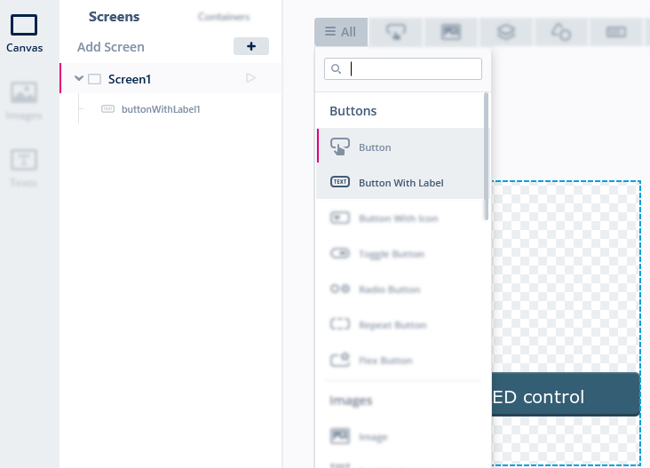
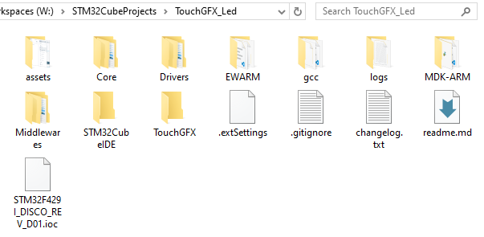
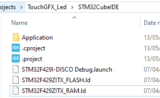
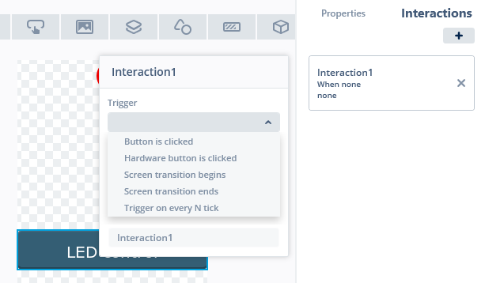
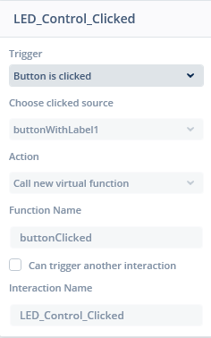
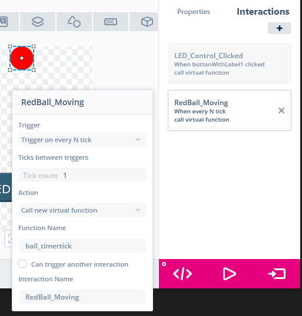
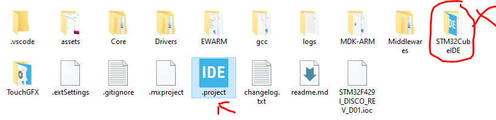
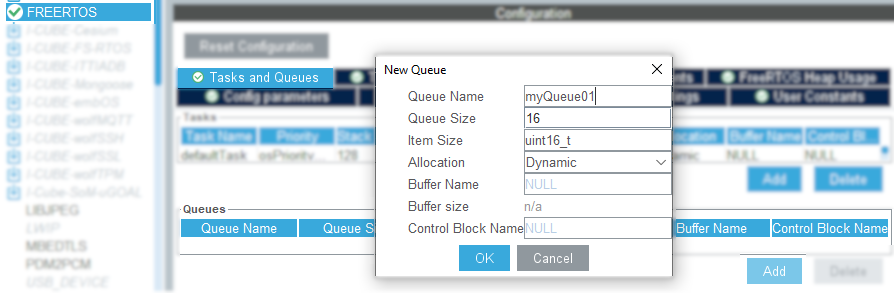

# TOUCHGFX VÀ ĐIỀU KHIỂN LED

## Giới thiệu

Bộ kit STM32F429-DISC1 có tich hợp săn màn hình LCD cảm ứng chạm 2.2inch, __ILI9341__ . Màn hình này có thể [mua rời ỏ đây](https://banlinhkien.com/man-hinh-lcd-tft-2.2-spi-ili9341-p13020870.html)

## Các bước lập trình

1. Tạo dự án mới bằng TouchGFX và gen code
2. Ở phần mềm __TouchGFX__, mục __Canvas__,  trong màn hình __Screen1__, thêm một widget __buttonWithLabel1__.
   
   Bấm __F4__ để gen code.
3. Mở thư mục mà mã nguồn được sinh ra với các thư mục con như hình vẽ.\
   \
   Mở thư mục con __STM32CubeIDE__, click vào file __.project__ để mở dự án bằng STM32CubeIDE.  
   \
   > Từ bây giờ, cứ mở cả 2 cửa sổ IDE __TouchGFX__ và __STM32Cube__ cùng lúc
4. Ở phần mềm __TouchGFX__, mục __Canvas__,  trong màn hình __Screen1__, tiếp tục thêm một widget __cicrle1__ với màu đỏ, đường kinh 20, nằm trong canvas 20x20.
    Bấm __F4__ để gen code.
5. Thêm hàm sự kiện cho nút bấm.\
   \
   Ví dụ:\
   \
   Bấm __F4__ để gen code.
6. Đăng kí hàm sự kiện theo thời gian, để tạo hiệu ứng chuyenr động của quả bóng đỏ.\
   \
   Bấm __F4__ để gen code.
7. Mở __STM32CubeIDE__, mở __Files / Open Projects from File System...__  để mở thư mục dự án do __TouchGFXX__ tạo ra.\
   Biên dịch và chạy thử thành công. Nhin thấy nút bấm và đốm đỏ.
   > Lưu ý: Có thể click vào file __.project__ ở thư mục ngoài cùng. Nhưng không click vào file cùng tên ở trong thư mục con.
   
8. Vẫn ở công cụ __STM32CubeIDE__, và ở file __.ioc__, cấu hình 3 chân pin:
   - PA0 là GPIO_Input
   - PG13 là GPIO_Output
   - PG14 là GPIO_Output
   > Xem lỗi [Không hiển thị được trên màn hình TouchScreen (màn hình trắng)](https://github.com/neittien0110/TouchGFX_Led/issues/1)
9. Ở file __.ioc__, khai báo thêm 1 __Message Queue__, có tên __myQueue01__ để tryên thông điệp từ nút bấm __PA0__ tới giao diện.\
   
   > Lưu ý rằng: __FreeRTOS__ mặc định đã được kich hoạt để sử dụng __TouchGFX__ rồi.
10. Viết hàm sự kiện để khi __bấm nút trên màn hình Touch thì bật đèn LD3 (PG13pin), LD4 (PG14 pin)__ \
    Xem lại ảnh này để thấy cần viết hàm callback như thế nào:\
    

      1. TouchGFX đã sinh ra hàm ảo __void buttonClicked()__ của nút bấm trên giao diện, khai báo trong file hoạt cảnh __Screen1ViewBase.cpp__. Không cần thao tác gì thêm.

         ```C
         void Screen1ViewBase::buttonCallbackHandler(const touchgfx::AbstractButton& src)
         {
            if (&src == &buttonWithLabel1)   /// Nếu đối tượng gây ra sự kiện là nút bấm có id = buttonWithLabel1
            {
               //LED_Control_Clicked         /// Tên gọi nhớ của sự kiện, trên phần mêm TouchGFX desinger
               buttonClicked();              /// Gọi hàm ảo sự kiện
            }
         }
         ```

      2. Khai báo chồng hàm ảo của sự kiện, trong file __.hpp__ của file hoạt cảnh screen tương ứng

         ```C
         #include "stm32f4xx_hal.h"                   /// Cần có để triệu gọi các hàm HAL         
         class Screen1View : public Screen1ViewBase
         {
            public:
            /**
             * * Hàm sự kiện, được gọi ra khi nút bấm Led Control trên màn hình được bấm
            */
            void buttonClicked();
         }
         ```

      3. Xây dựng hàm ảo đầy đủ của sự kiện, trong file __.cpp__ của file hoạt cảnh screen tương ứng

         ```C
         void Screen1View::buttonClicked()
         {
            /// Đảo giá trị tắt/bật đèn led mặc định trên board.
            HAL_GPIO_TogglePin(GPIOG, GPIO_PIN_13);
         }
         ```

    Đã xong tương tác theo hướng __Giao diện --> HAL__.\
    Tiếp theo sẽ là tương tác theo hướng __HAL --> Giao diện__.
11. Trong STM32Cube, mở file __.ioc__, và thiết lập nút bấm USER màu xanh với chân pin __PA0__ là __GPIO_Input__
12. Viết hàm sự kiện để khi __bấm nút trên USER trên board và hiển thị trên màn hình__: \
      1. TouchGFX đã sinh ra hàm ảo __void ball_timertick()__ của nút bấm trên giao diện, khai báo trong file hoạt cảnh __Screen1ViewBase.cpp__. Không cần thao tác gì thêm.

         ```C
         void Screen1ViewBase::handleTickEvent()
         {
            //RedBall_Moving                 /// Tên gọi nhớ của sự kiện, trên phần mêm TouchGFX desinger
            ball_timertick();                /// Gọi hàm ảo sự kiện
         }
         ```

      2. Khai báo chồng hàm ảo của sự kiện, trong file __.hpp__ của file hoạt cảnh screen tương ứng

         ```C
         #include <stm32f4xx_hal.h>       /// Cần có để triệu gọi các hàm HAL
         #include <cmsis_os2.h>           /// Cần có đề thao tác với MessageQueue
         #include <math.h>                /// Cần có để Sử dụng các hàm toán học như sin, cos

         extern "C" osMessageQueueId_t myQueue01Handle;   /// Được đặc tả trong main.c

         class Screen1View : public Screen1ViewBase
         {
            public:
               /**
               * * Hàm sự kiện, được gọi ra sau mỗi tic-tok thời gian xảy ra ở đốm đỏ trên màn hình
               */
               void ball_timertick();
            protected:
               /**
               * Biến đếm thời gian, để gui đổi thành tọa độ đốm đỏ.
               */
               uint32_t tickCount = 0;            
         }
         ```

      3. Xây dựng hàm ảo đầy đủ của sự kiện, trong file __.cpp__ của file hoạt cảnh screen tương ứng

         ```C
         void Screen1View::ball_timertick()
         {
            /// tickCount tăng xoay vòng: 0, 2, 4, 8, 236, 238.
            tickCount +=2;
            tickCount = tickCount % 240;

            /// Công thức tính tọa độ đốm tròn mới
            float x = tickCount / 55.0f;
            float y = sin(x) + sin(2*x) + sin(3*x) + 1;

            /** Message lấy ra từ hàng đợi*/
            uint8_t msg;

            /// Nếu như có 1 message nào đó vẫn còn trong hàng đợi chỉ định...
            if (osMessageQueueGetCount(myQueue01Handle) > 0) {
               /// thì đọc message
               osMessageQueueGet(myQueue01Handle, &msg, NULL, osWaitForever);
               /// Nếu message đúng nội dung quan tâm
               if (msg == 'X') {
                  /// Di chuyển đốm đỏ đến tọa độ mới
                  circle1.moveTo((int16_t)floor(x*55),200 -(int16_t)floor(y*50));
                  /// Các thao tác đồ họa nói trên chỉ nhằm vẽ vào bộ đệm màn hình, trang đồ họa hậu trường.
                  /// Cần phải gọi hàm invalidate để dữ liệu trong bộ đệm đó được đẩy ra màn hình chính.
                  circle1.invalidate();
               }
            } else {
               /// Nếu không bấm nút thì giao diện không thay đổi
            }
         }
         ```

Hết.
