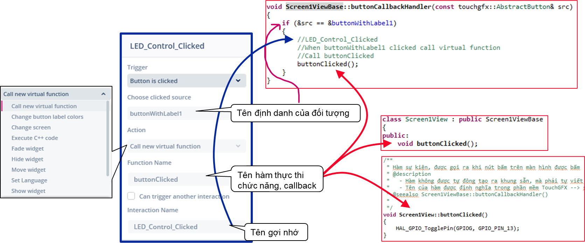

# TOUCHGFX VÀ ĐIỀU KHIỂN LED

## Các bước lập trình

1. Tạo dự án mới bằng TouchGFX và gen code
2. Ở phần mềm __TouchGFX__, mục __Canvas__,  trong màn hình __Screen1__, thêm một widget __buttonWithLabel1__.
   
   Bấm __F4__ để gen code.
3. Mở thư mục mà mã nguồn được sinh ra với các thư mục con như hình vẽ.\
   
   Mở thư mục con __STM32CubeIDE__, click vào file __.project__ để mở dự án bằng STM32CubeIDE.  
   
   > Từ bây giờ, cứ mở cả 2 cửa sổ IDE __TouchGFX__ và __STM32Cube__ cùng lúc
4. Ở phần mềm __TouchGFX__, mục __Canvas__,  trong màn hình __Screen1__, tiếp tục thêm một widget __cicrle1__ với màu đỏ, đường kinh 20, nằm trong canvas 20x20.
    Bấm __F4__ để gen code.
5. Thêm hàm sự kiện cho nút bấm.\
   \
   Ví dụ:\
   \
   Bấm __F4__ để gen code.
6. Đăng kí hàm sự kiện theo thời gian, để tạo hiệu ứng chuyenr động của quả bóng đỏ.\
   \
   Bấm __F4__ để gen code.
7. Mở __STM32CubeIDE__, mở __Files / Open Projects from File System...__  để mở thư mục dự án do __TouchGFXX__ tạo ra.\
   Biên dịch và chạy thử thành công. Nhin thấy nút bấm và đốm đỏ.
   > Lưu ý: Có thể click vào file __.project__ ở thư mục ngoài cùng. Nhưng không click vào file cùng tên ở trong thư mục con.
   
8. Vẫn ở công cụ __STM32CubeIDE__, và ở file __.ioc__, cấu hình 3 chân pin:
   - PA0 là GPIO_Input
   - PG13 là GPIO_Output
   - PG14 là GPIO_Output
   > Xem lỗi [Không hiển thị được trên màn hình TouchScreen (màn hình trắng)](https://github.com/neittien0110/TouchGFX_Led/issues/1)
9. Ở file __.ioc__, khai báo thêm 1 __Message Queue__, có tên __myQueue01__ để tryên thông điệp từ nút bấm __PA0__ tới giao diện.\
   
   > Lưu ý rằng: __FreeRTOS__ mặc định đã được kich hoạt để sử dụng __TouchGFX__ rồi.
